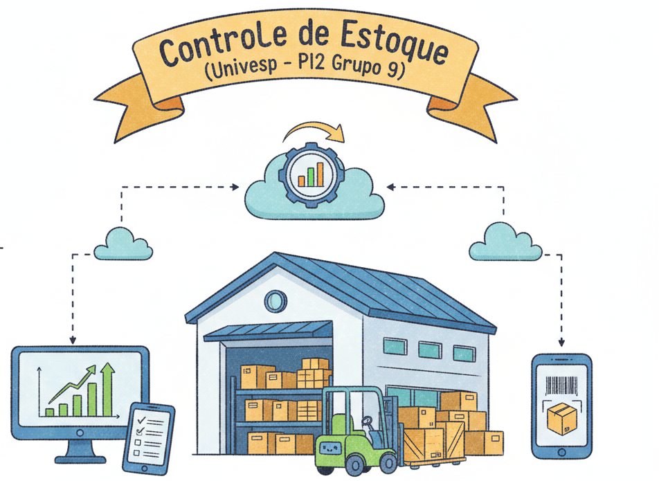

# Controle de Estoque



## Sobre

Este projeto é uma aplicação web para auxiliar no controle e gerenciamento de estoque. Ele permite aos usuários gerenciar e monitorar os produtos disponíveis, garantindo que a quantidade certa de itens esteja disponível no momento certo, evitando excessos ou faltas.

## Estrutura do Projeto

```
controle-estoque/
├── app.py                              # Arquivo principal da aplicação Flask
├── controle_estoque.bat                # Bash script para autotizar a instalação do HyperCorn e executar o projeto
├── controle_estoque.db                 # Banco de Dados do SQLite
├── LICENSE                             # Arquivo de licença MIT
├── requiriments.txt                    # Arquivos geraro pelo PIP dentro do ambiente virtual do Conda, para instalação dos módulos Python
├── schema.sql                          # Arquivo SQL para construção do Bando de Dados, caso ele não exista. Sua execução deve ser: python app.py
├── README.md                           # Arquivo de documentação do projeto
├── templates/                          # Pasta para os templates HTML (Jinja2)
│   ├── adicionar_roupa.html            # Template para adicionar roupas
│   ├── atualizar_dados_empresa.html    # Template para atualizar dados da empresa
│   ├── base.html                       # Template base para os demais templates
│   ├── cadastrar_funcionários.html     # Templete para adicionar funcionários
│   ├── dados_empresa.html              # Template que exibe as informações da empresa
│   ├── dashboard.html                  # Template onde há o painel com os links para todas as funções primárias, como: roupas, funcionários, empresa e clientes
│   ├── editar_cliente.html             # Template para editar os daddos dos clientes já cadastrados
│   ├── editar_funcionario.html         # Template para editar os dados dos funcionário já cadastrados
│   ├── editar_roupa.html               # Template para edição de roupas já cadastradas
│   ├── index.html                      # Template inicial do sistema de estoque
│   ├── listar_funcionarios.html        # Template para listar os funcionários cadastrados no sistema
│   ├── listar_roupas.html              # Template para listar as roupas cadastradas
│   ├── metrica.html                    # Template para analisar os dados do estoque e de vendas
│   ├── nova_senha.html                 # template para acessar o painel de recuperação senha
│   ├── painel_clientes.html            # Template para listar e cadastrar clientes
│   ├── painel_compras.html             # Template para que serve como uma sacola de compras
│   ├── recuperar_senha.html            # Template para recupara a senha
│   ├── registrar.html                  # Template para registro de usuários para acessar o sistema
│   └── revisar_compra.html             # Template para revisar a compra
├── static/                             # Diretório para arquivos estáticos (CSS, JavaScript, imagens)
│   ├── css/                            # Folhas de estilo CSS
│   ├── ├── Fontes/                     # Diretório para armazenar as fontes usadas nas folhas de estilo
│   ├── ├── ├── Gafata-Regular.ttf
│   ├── ├── ├── Geist-Thin.ttf
│   ├── ├── └── PlaywriteHU-Regular.ttf
│   │   └── style.css                    # Estilo principal da aplicação
│   ├── js/                              # Arquivos JavaScript
│   │   └── funcionarios.js                
└── └── imagens/                         # Imagens do projeto
    └── ├──controle_estoque.ico
        └── controle.png
```

## 1. Tecnologias

[](https://choosealicense.com/licenses/mit/)


### 1.1. Pré-requisitos

Certifique-se de ter o Python instalado (versão 3.6 ou superior). Recomenda-se o uso de um ambiente virtual para isolar as dependências do projeto. Você pode usar o `venv` (nativo do Python) ou o Anaconda.

### 1.2. Instalação

- 1.  Clone o repositório:

    ```
    git clone https://github.com/RodrigoCAzevedo/controle-estoque.git
    cd controle-estoque
    ```
- No caso do clone há outras opções além do HTTPS:
  - SSH: git@github.com:RodrigoCAzevedo/controle-estoque.git
  - GitHub CLI: gh repo clone RodrigoCAzevedo/controle-estoque

- 2.  Crie e ative um ambiente virtual (opcional, mas recomendado):

    *   **Python venv:**

        ```
        python3 -m venv venv
        source venv/bin/activate   # No Linux/macOS
        venv\Scripts\activate.bat  # No Windows
        ```
    *   **Anaconda:**

        ```
        conda create --name <nome_do_ambiente> python=3.x
        conda activate <nome_do_ambiente>
        ``` 

- 3.  Instale as dependências:

 - Opção 1: (Recomendada)

    - Windows:
    ```
    → controle_estoque.bat                # Bash script para Windows
        |→ hypercorn --bind 127.0.0.1:80  # Para Windows
    ```
   - Linux:
   ```
   → hypercorn --bind 127.0.0.1:8080     # Para Linux
   ```

 - Opção 2:

    ```
    pip install -r requirements.txt
    ```
    *No código já tem um mecanismo de instalação automático dos módulos


- 4.  Crie o banco de dados:
4. 
    ```
    flask init-db
    ```

### 1.3. Execução

**Ambiente de Desenvolvimento**

```
flask run --port 80 --debug     # Windows
flask run --port 8080 --debug   # Linux
```
 - → **Windows:** http://localhost:80
 - → **Linux:** http://localhost:8080

**Ambiente de Produção**

```
hypercorn --bind 0.0.0.0:80 app:app   # Windows
hypercorn --bind 0.0.0.0:8080 app:app # Linux
```
 - → **Windows:** http://localhost:80
 - → **Linux:** http://localhost:8080

## 2. Funcionalidades
- **Login/Registro:** Autenticação de usuários com senhas criptografadas.
- **Dashboard:** Painel de controle centralizado com acesso às principais funcionalidades.
- **Gerênciar de Produtos:**
    - Lista de Roupas.
      - Cadastrar de Roupas
        - Editar Roupas

- **Gerênciar Funcionários:**
    - Listar Funcionários
      - Cadastrar Funcionários
        - Editar Cadastro de Funcionários

- **Gerenciamento de Clientes:** 
  - Cadastro e Listagem de clientes.
    - Editar Cadastro de Clientes

## 3. Acesso ao Projeto
- URLs de acesso:
  - **Desenvolvimento:**
    - **Windows**: `http://localhost:80` (_flask run --host=127.0.0.1 --port=80 --debug_)
    - **Linux**: `https://localhost:8080` (_flask run --host=127.0.0.1 --port=8080 --debug_)
  - **Produção:** 
    - **Windows**: `http://localhost:80` (_hypercorn --bind 127.0.0.1:80 app:app_)
    - **Linux**: `https://localhost:8080` (_hypercorn --bind 127.0.0.1:8080 app:app_)

## 4. Desenvolvedor

- [Bruno de F. Rolim - 23227952]()
- [Elana B. Domingues - 1821949](https://github.com/Lanabredariol)
- [Juliana L. C. Azevedo](https://github.com/Juliana026)
- [Lucas J. Silva - 23203679](https://github.com/L1u2c)
- [Nícolas M. Freitas - 23203375](https://github.com/nicolasmafre)
- [Renan F. Jacobsen - 23206769]()
- [Rodrigo C. Azevedo](https://github.com/RodrigoCAzevedo)
